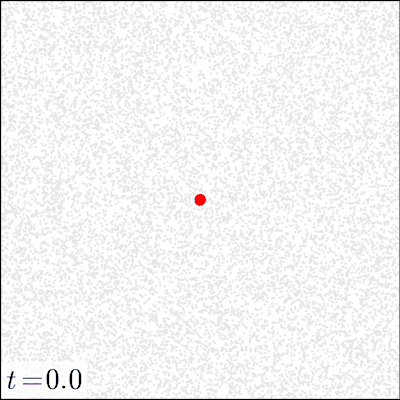

# Supplementary animations

The colours are as follows:

* grey dots: tissue particles
* red points: pathogen particles
* green points: toxin particles
* blue points: activated immune effectors (kill state)
* black points: decapacitated immune effectors

## Low dose, local mechanism. 

## Low dose, distant mechanism

## High dose, local mechanism

## High dose, distant mechanism

